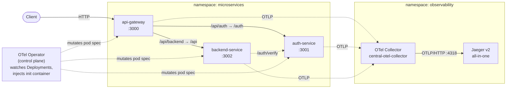

# Zero-Code Distributed Tracing on Kubernetes with OpenTelemetry

_Add full distributed tracing to a Kubernetes microservices app — across every service boundary — without changing a single line of source code._


## Why this matters

Distributed tracing is the single most useful tool for understanding how a request actually flows through a microservices system — which service called which, where the latency went, and where it failed. The traditional path to getting it, though, is invasive: you add an OpenTelemetry SDK dependency to every service, wire up a tracer at startup, and instrument your HTTP clients and frameworks by hand. For a handful of services maintained by one team that is merely tedious. Across dozens of services owned by different teams — some of which you may not even be able to rebuild on demand — it becomes a real adoption blocker.

The OpenTelemetry Operator removes that blocker. Instead of touching application code, you deploy the operator into your cluster, declare an `Instrumentation` resource, and add **one annotation** to each Deployment. The operator's admission webhook then mutates the pod spec on the fly: it injects an init container that drops the Node.js OTel SDK into the container's filesystem and sets `NODE_OPTIONS` so the SDK auto-loads when the process boots. Your service starts emitting spans for inbound and outbound HTTP — and you never opened an editor.

The piece that makes the resulting spans line up into a single end-to-end trace is **context propagation**. When `api-gateway` calls `auth-service`, the SDK serializes the active trace context into HTTP headers — the W3C [`traceparent`](https://www.w3.org/TR/trace-context/) header for the trace/span IDs, and [`baggage`](https://www.w3.org/TR/baggage/) for user-defined key-value pairs that travel alongside the trace. The receiving service's SDK reads those headers back and continues the same trace. The result is one Jaeger trace, one shared trace ID, spanning all three services — produced with zero code changes. This repo shows exactly how to get there.

## Architecture



Solid arrows are application request flow; dotted arrows are telemetry. The **OTel Operator** sits in the control plane: it does not handle a single span itself — it only watches Deployments and rewrites their pod specs so the application pods carry the auto-instrumentation init container. Each instrumented pod exports spans over OTLP to the **OTel Collector** in the `observability` namespace, which filters probe noise, batches, and forwards everything to **Jaeger**.

## Prerequisites

- A running **Kubernetes** cluster (v1.27+ recommended) and `kubectl` configured to reach it.
- **Helm v3+** (used by some optional install paths; the scripts here use raw `kubectl apply`).
- **`bash`** available locally to run the helper scripts in `manifests/`.
- The sample workload from **[node-microservice-template](https://github.com/ashok-m-sudo/node-microservice-template)** already deployed to the `microservices` namespace (Deployments: `api-gateway`, `auth-service`, `backend-service`).

## Quickstart

Each step below is a one-line summary; full commands and explanations live in **[docs/deployment-guide.md](docs/deployment-guide.md)**.

1. **Create the `observability` namespace** — `kubectl apply -f manifests/00-namespace.yaml`. ([guide](docs/deployment-guide.md#1-create-the-observability-namespace))
2. **Install cert-manager** (provides the webhook TLS certs the operator needs) — `bash manifests/01-install-cert-manager.sh`. ([guide](docs/deployment-guide.md#2-install-cert-manager))
3. **Install the OpenTelemetry Operator** — `bash manifests/02-install-otel-operator.sh`. ([guide](docs/deployment-guide.md#3-install-the-opentelemetry-operator))
4. **Deploy Jaeger v2 all-in-one** — `kubectl apply -f manifests/04-jaeger-all-in-one.yaml`. ([guide](docs/deployment-guide.md#4-deploy-jaeger-all-in-one))
5. **Deploy the OTel Collector** — `kubectl apply -f manifests/03-otel-collector.yaml`. ([guide](docs/deployment-guide.md#5-deploy-the-otel-collector))
6. **Create the Instrumentation resource** — `kubectl apply -f manifests/05-instrumentation.yaml`. ([guide](docs/deployment-guide.md#6-create-the-instrumentation-resource))
7. **Annotate the workload to enable auto-injection** — `bash manifests/06-annotate-workloads.sh`, then generate traffic and open Jaeger. ([guide](docs/deployment-guide.md#7-annotate-the-workload-deployments) · [verify](docs/verification.md))

## Repository structure

```
otel-zero-code-instrumentation-k8s/
├── README.md
├── LICENSE                                  (MIT)
├── .gitignore
├── docs/
│   ├── architecture.md
│   ├── deployment-guide.md
│   ├── verification.md
│   └── troubleshooting.md
├── manifests/
│   ├── 00-namespace.yaml
│   ├── 01-install-cert-manager.sh
│   ├── 02-install-otel-operator.sh
│   ├── 03-otel-collector.yaml
│   ├── 04-jaeger-all-in-one.yaml
│   ├── 05-instrumentation.yaml
│   └── 06-annotate-workloads.sh
└── images/
    └── .gitkeep                             (placeholder; screenshots go here)
```

## Related projects

This repo is the first of four that together demonstrate a Kubernetes observability practice:

- **[node-microservice-template](https://github.com/ashok-m-sudo/node-microservice-template)** — the sample Node.js/Express workload (`api-gateway`, `auth-service`, `backend-service`) instrumented here.
- **otel-spanmetrics-apm** — deriving RED/APM metrics from spans via the spanmetrics connector. _(planned — coming soon)_
- **ceph-distributed-tracing-jaeger-v2** — production-grade Jaeger v2 with a persistent storage backend. _(planned — coming soon)_

## License

Released under the [MIT License](LICENSE).